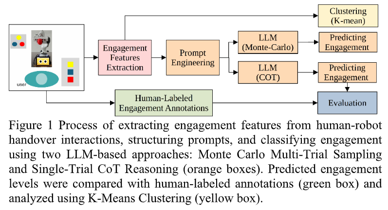

# LLM-Based Engagement Classification in Human-Robot Interaction

This repository provides code for engagement classification in human-robot interaction (HRI) using Large Language Models (LLMs). The dataset consists of human movement, emotion, and cognitive features collected from video recordings of object handover interactions. The model classifies engagement levels into low, middle, or high using structured prompting.

Figure 1: The engagement classification process using Monte Carlo Multi-Trial Sampling and Single-Trial CoT Reasoning. Human-labeled annotations were used for comparison, and K-Means clustering was applied for analysis.
